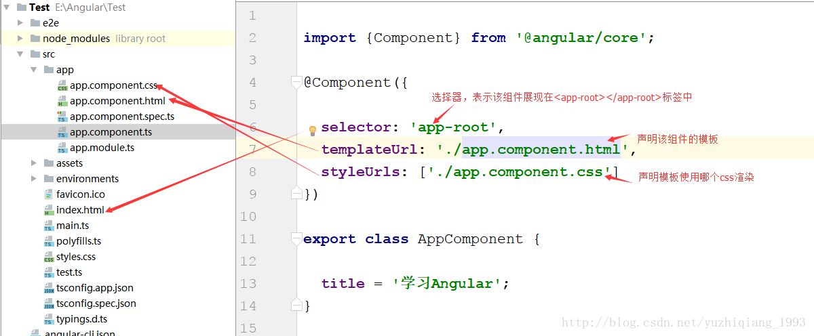

### 1. 组件相关概念

#### 1.1 组件元数据装饰器（@Component）
 简称组件装饰器，用来告知Angular框架如何处理一个TypeScript类.Component装饰器包含多个属性，这些属性的值叫做元数据，Angular会根据这些元数据的值来渲染组件并执行组件的逻辑

#### 1.2 模板（Template）
我们可以通过组件自带的模板来定义组件的外观，模板以html的形式存在，告诉Angular如何来渲染组件，一般来说，模板看起来很像html，但是我们可以在模板中使用Angular的数据绑定语法，来呈现控制器中的数据。

#### 1.3 控制器（controller）
控制器就是一个普通的typescript类，他会被@Component来装饰，控制器会包含组件所有的属性和方法，绝大多数的业务逻辑都是写在控制器里的。控制器通过数据绑定与模板来通讯，模板展现控制器的数据，控制器处理模板上发生的事件。

### 2. 装饰器
模板和控制器是组件的必备要素。还有一些可选的元素，比如：
+ 输入属性（@inputs）:是用来接收外部传入的数据的,Angular的程序结构就是一个组件树，输入属性允许在组件树种传递数据提供器（providers）：这个是用来做依赖注入的
+ 生命周期钩子（LifeCycle Hooks）：一个组件从创建到销毁的过程中会有多个钩子会被触发，类似于Android中的Activity的生命周期
+ 样式表：组件可以关联一些样式表
+ 动画（Animations）： Angular提供了一个动画包来帮助我们方便的创建一些跟组件相关的动画效果，比如淡入淡出等
+ 输出属性（@Outputs）：用来定义一些其他组件可能需要的事件或者用来在组件之间共享数据
+ 组件关系图

